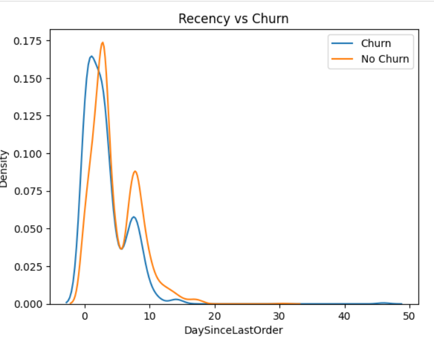
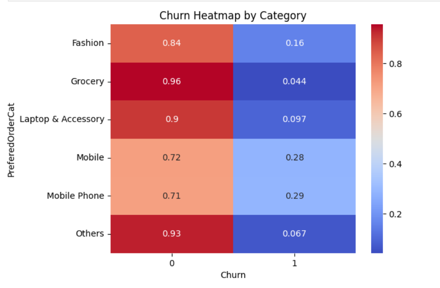
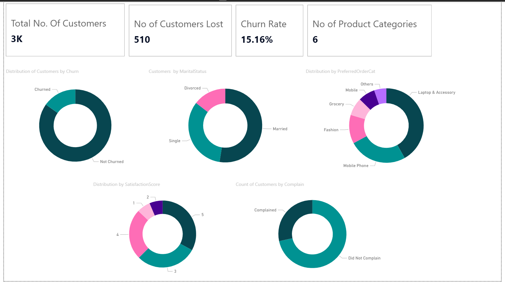
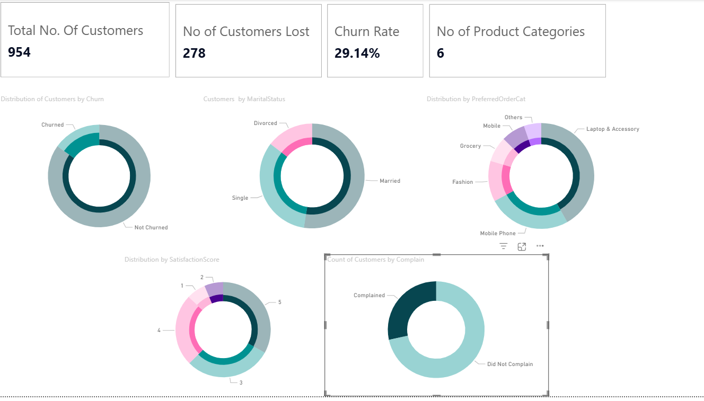
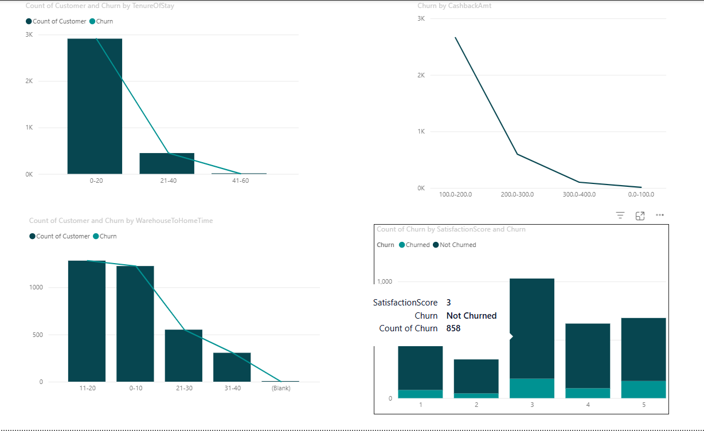
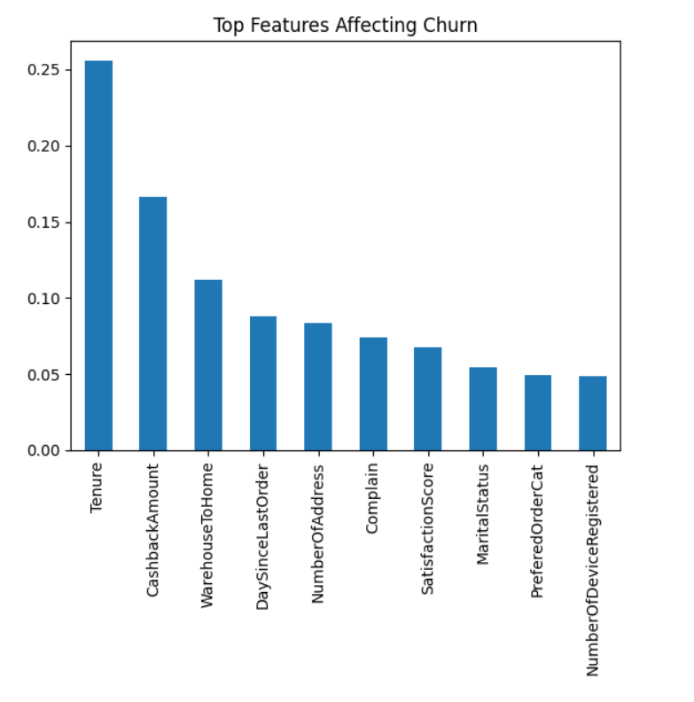

#  ECommerce-Customer-Churn-Analysis

## Project Overview

An **end-to-end** data science project focused on analyzing customer behavior, predicting churn using machine learning, and delivering actionable business insights through an interactive dashboard.

Customer churn is a critical problem for online businesses because retaining existing customers is significantly cheaper than acquiring new ones. Through visualization and statistical analysis, this project aims to uncover insights that can help businesses improve customer retention strategies.

---

## 🎯 Objectives

1. Analyze customer behavior patterns in an e-commerce platform.

2. Identify factors that influence customer churn.

3. Perform data cleaning and preprocessing for reliable analysis.

4. Use EDA and data visualization techniques to reveal meaningful trends.

5. Build machine learning models to predict churn.

6. Visualize insights using an interactive Power BI dashboard

## 📊 Dataset Features
Source: Kaggle – E-Commerce Customer Churn Dataset 

The dataset contains customer attributes related to their purchasing behavior and experience with the platform.

1. Tenure – Duration of customer relationship

2. WarehouseToHome – Distance between warehouse and customer

3. NumberOfDeviceRegistered – Devices used by the customer

4. PreferedOrderCat – Preferred order category

5. SatisfactionScore – Customer satisfaction rating

6. MaritalStatus

7. NumberOfAddress

8. Complain – Whether the customer filed complaints

9. DaySinceLastOrder – Recency of last purchase

10. CashbackAmount

11. Churn – Target variable indicating whether the customer left

## 🛠️ Tech Stack

### Programming Language

Python

### Libraries Used

1. Pandas – Data manipulation

2. NumPy – Numerical operations

3. Matplotlib – Data visualization

4. Seaborn – Advanced statistical plots

5. Scikit-learn – Machine learning and Evaluation Metrics

6. Pickle - Deployemnt

### Dashboard Environment
Power BI

### Development Environment
Jupyter Notebook, VS Code 

## 💡 Skills Demonstrated

This project showcases the following data analytics skills:

1. Data Cleaning

2. Handling Missing Values

3. Exploratory Data Analysis (EDA)

4. Data Visualization

5. Understanding Features and their Importance

6. Outlier Detection

7. Dataset Preparation for Machine Learning

8. Machine Learning

9. Model Evaluation

10. Prediction Systems

11. BI using Dashboards

12. Python Data Analysis Workflow

## 🧠 Project Workflow

### 1. Data Preprocessing
- Handling missing values
- Encoding categorical variables
- Feature scaling

### 2. Exploratory Data Analysis (EDA)
- Churn distribution analysis
- Customer segmentation
- Feature relationships with churn
- Correlation analysis

### 3. Machine Learning Models
- Logistic Regression
- Decision Tree Classifier
- Random Forest Classifier

### 4. Model Evaluation
- Accuracy
- Precision
- Recall
- F1 Score
- ROC-AUC Score

### 5. Feature Importance Analysis
- Identified key drivers of churn

### 6. Churn Prediction System
- Predicts whether a customer will churn
- Outputs churn probability

### 7. Dashboard (Power BI)
- Interactive visual analytics
- Business-focused insights

## 🤖 Machine Learning Results

| Models              | Accuracy | Precision | Recall | F1 Score | ROC-AUC |
|---------------------|----------|-----------|--------|----------|---------|
| Logistic Regression | 88.33%   | 76.06%    | 41.86% | 54%      | 85.78%  |
| Decision Tree       | 90.62%   | 69.78%    | 75.19% | 72.39%   | 84.42%  |
| Random Forest       | 94.42%   | 84%       | 81.40% | 82.68%   | --      |

## 🔮 Churn Prediction

The model predicts:
- ✅ Whether a customer will churn  
- 📈 Probability of churn  

## 🔍 Key Findings/Insights

Some important patterns observed from the analysis:

1. Customers with higher recency (long time since last order) show higher churn probability.

2. Customer complaints strongly correlate with churn.

3. Certain product categories have noticeably higher churn rates.

4. Customer satisfaction scores influence retention.

5. Customers with low engagement (orders, app usage) are at higher risk.

These insights highlight the importance of customer experience, incentives, and engagement in preventing churn.

## 📌 Conclusion

This analysis provides valuable insights into customer churn behavior in an e-commerce environment. By understanding factors such as customer satisfaction, complaints, purchase recency, and order categories, businesses can design better strategies to improve retention and customer experience.
